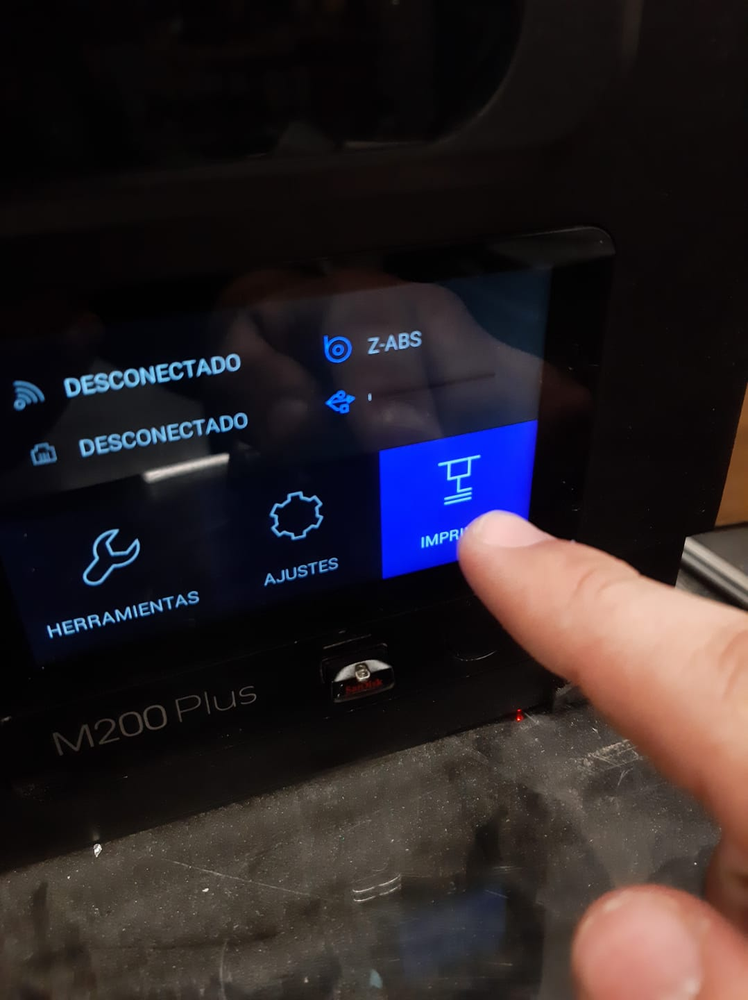

# Impresora 3D

### 1. Descargar [Z-Suite](https://zortrax.com/software/)

### 2. Crear una cuenta e iniciar sesión en la aplicación

### 3. Iniciar un nuevo proyecto para Zortrax M200Plus

### 4. Exportar de tu software 3D como STL, OBJ o FBX

### 5. Importar a Z-Suite

## 6. Acomoda tus modelos en la base

### 7. Configura la impresión

### 8. Exportar la impresión al USB

### 9. Conecta la impresora 3D

### 10. Prender la impresora 3D

### 11. Checar el filamento

### 12. Introducir USB, seleccionar imprimir, seleccionar el ZCode, imprimir y esperar
