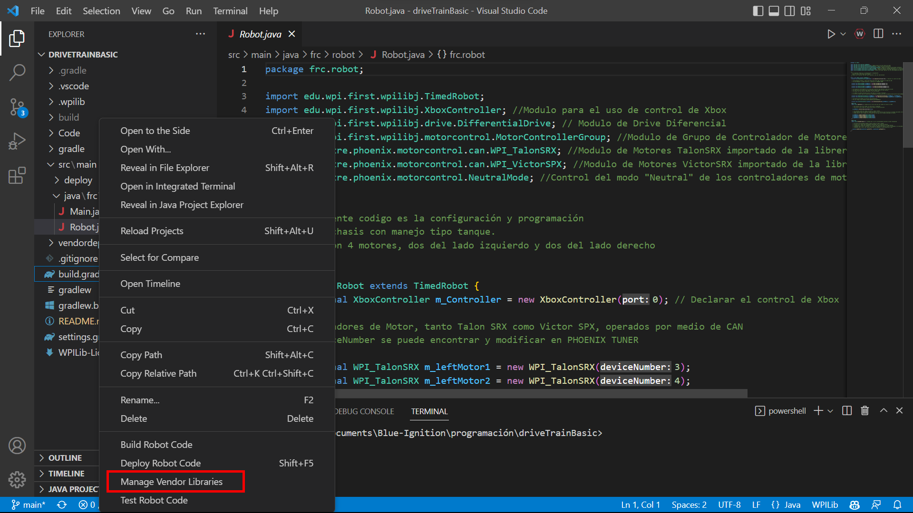
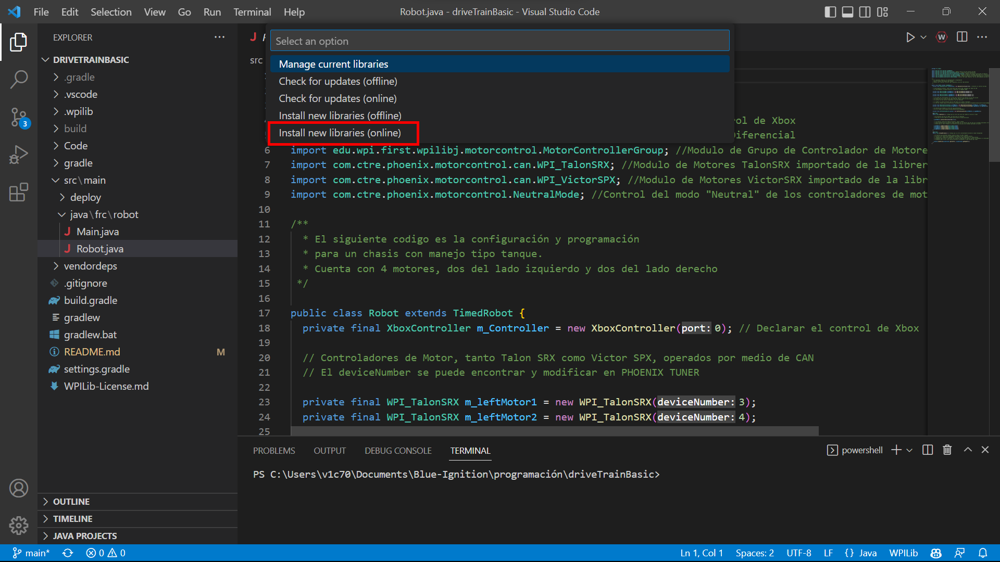
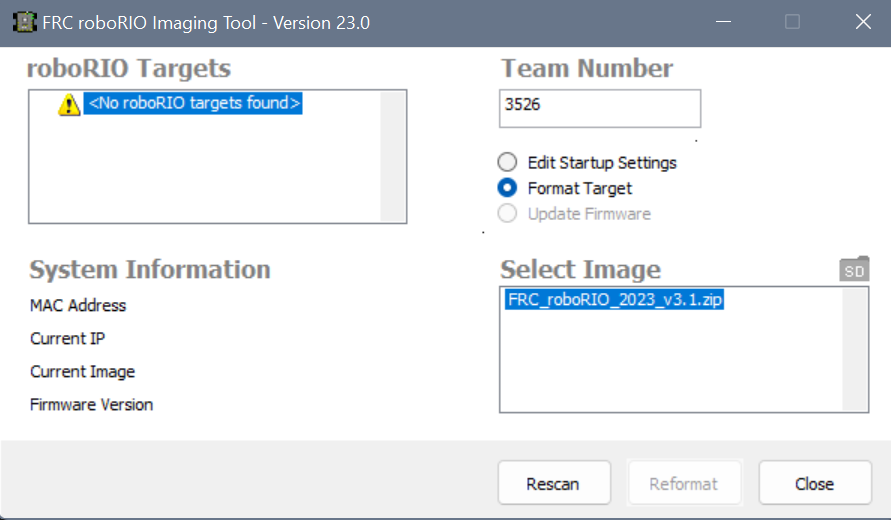

# Programación Blue Ignition

Este repositorio contiene bases de codigo para robots de frc, asi como la programación de la temporada en curso. Mas adelante hay una sección de como instalar la libreria de controladores de CTR-Electronics y como actualizar el roborio para la nueva temporada.

## Pasos basicos de programación

---

## Instalación de Libreria para Controladores de CTR-Electronics
Aplica para controladores en modo "CAN"

1. Una vez que nuestro proyecto haya sido creado en Vscode le das click derecho al archivo ***build.gradle***

2. En el menu que se despliega, das click en **"Manage Vendor Libraries"**

3. Seleccionas la opcion que dice **"Install new library (online)"**

4. Usar el siguiente link: 
https://maven.ctr-electronics.com/release/com/ctre/phoenix/Phoenix5-frc2023-latest.json

 ****Nota: Solo para la temporada 2023***. Para consultar el link vigente usar la siguiente pagina: https://v5.docs.ctr-electronics.com/en/stable/ch05a_CppJava.html

---
Link de libreria de NavX: https://www.kauailabs.com/dist/frc/2022/navx_frc.json

---

## Actualización de ROBORIO para nueva temporada

1. Abrir el programa **"Roborio Imaging Tool"** (Viene instalado junto al paquete de National Instruments)
2. Conectar el roborio a la computadora mediante un cable usb
3. Una vez que el programa detecte la roborio. Seleccionar la opcion **"Format Target"** y seleccionar la imagen disponible. Ingresar el numero de equipo *(3526)*
4. Click en **"Reformat"** (NO DESCONECTAR LA ROBORIO)

